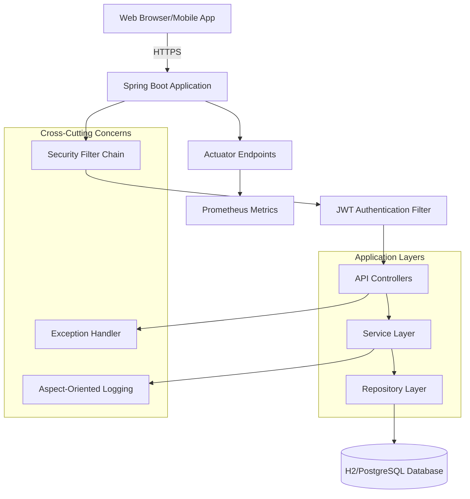
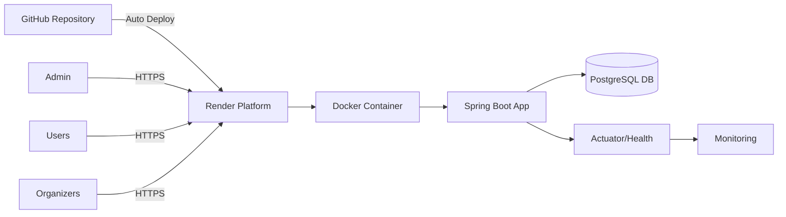
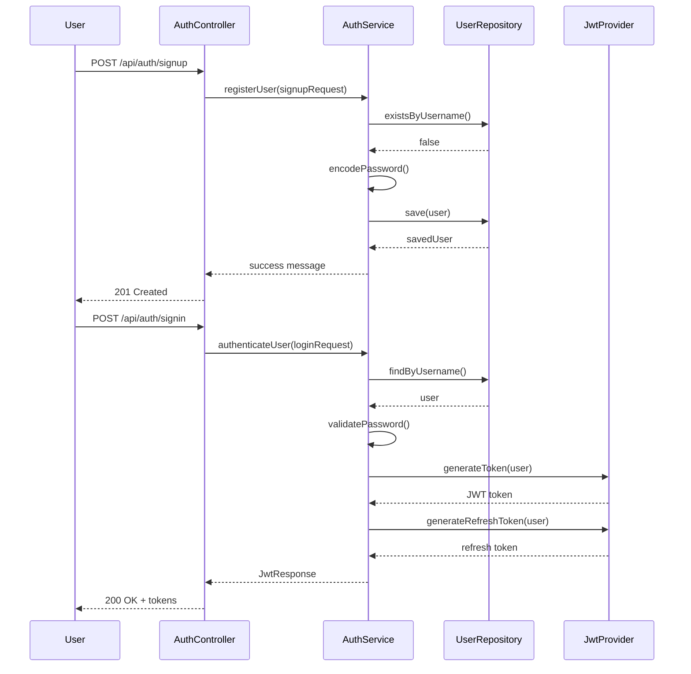
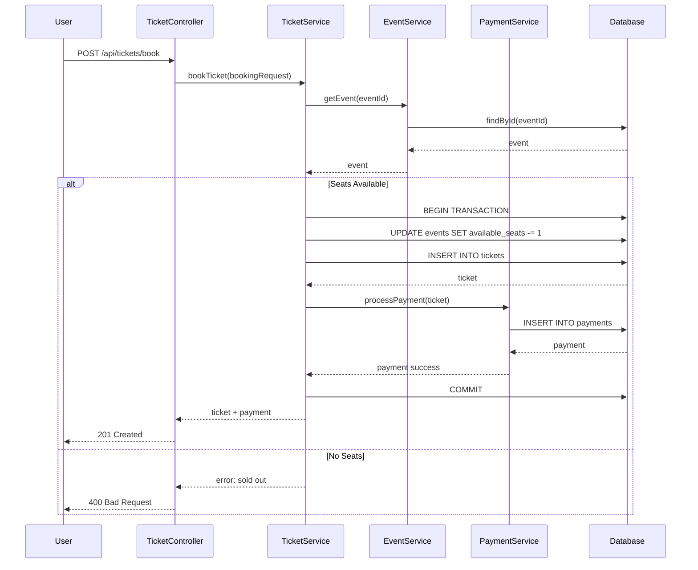
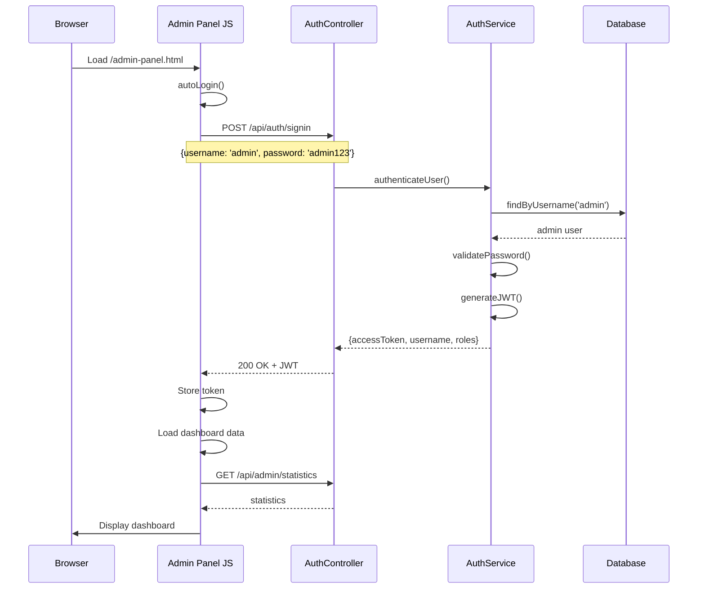

# System Design Document
## EventPlanner - Event Booking Platform

**Course:** COMP 301 – Software Architectures and Tools  
**Team:** [Your Team Name]  
**Members:** [Team Member Names and Roles]  
**Date:** January 8, 2026  
**Version:** 1.0

---

## 1. Executive Summary

### 1.1 Project Overview
EventPlanner is a comprehensive event booking platform built with Spring Boot that enables event organizers to create and manage events, while attendees can discover, book tickets, and make secure payments. The system implements role-based access control with three distinct user types: regular users, event organizers, and system administrators.

### 1.2 Target Users
- **Event Organizers:** Create and manage events, track ticket sales and revenue
- **Attendees/Users:** Browse events, purchase tickets, manage bookings
- **System Administrators:** Oversee platform operations, user management, and security monitoring

### 1.3 Technology Stack
- **Backend:** Spring Boot 3.5.6, Java 22
- **Database:** H2 (development), PostgreSQL (production)
- **Security:** Spring Security, JWT Authentication
- **Deployment:** Render Cloud Platform
- **Monitoring:** Spring Actuator, Prometheus

### 1.4 Scope
This document covers the system architecture, component design, API specifications, database schemas, and deployment strategy for the EventPlanner platform.

---

## 2. Goals & Non-Functional Requirements

### 2.1 Performance Goals
- **API Response Time:** Average < 300ms for standard operations
- **Throughput:** Support 1,000+ concurrent users
- **Database Queries:** Optimized with indexing and connection pooling

### 2.2 Availability & Reliability
- **Uptime Target:** 99.5% availability
- **Health Monitoring:** Automated health checks via Actuator endpoints
- **Error Handling:** Comprehensive exception handling with meaningful error messages

### 2.3 Security Requirements
- **Authentication:** JWT-based token authentication with refresh token support
- **Authorization:** Role-based access control (RBAC)
- **Password Security:** BCrypt encryption with salt
- **Audit Logging:** Track all security-related events
- **Data Protection:** TLS/HTTPS for data in transit

### 2.4 Scalability
- **Horizontal Scaling:** Stateless application design for easy scaling
- **Database Optimization:** Connection pooling, query optimization
- **Caching Strategy:** Redis integration for frequently accessed data

### 2.5 Maintainability
- **Code Quality:** Clean architecture with separation of concerns
- **Documentation:** Comprehensive API documentation
- **Logging:** Structured logging with multiple levels
- **Testing:** Unit tests, integration tests

---

## 3. Functional Requirements

### 3.1 User Management
1. **User Registration:** Users can create accounts with email and password
2. **Authentication:** Secure login with JWT token generation
3. **Profile Management:** Users can view and update their profiles
4. **Role Assignment:** Support for USER, ORGANIZER, and ADMIN roles

### 3.2 Event Management
1. **Event Creation:** Organizers can create events with details (title, description, location, date, capacity, price)
2. **Event Browsing:** Users can search and filter events
3. **Event Updates:** Organizers can modify their events
4. **Event Categories:** Support for different event types (concert, conference, sports, etc.)

### 3.3 Ticket Booking System
1. **Ticket Purchase:** Users can book tickets for available events
2. **Seat Management:** Track available and sold seats
3. **Booking History:** Users can view their booking history
4. **Ticket Status:** Track ticket status (active, used, cancelled)

### 3.4 Payment Processing
1. **Payment Methods:** Support multiple payment methods
2. **Transaction Recording:** Secure payment transaction logging
3. **Payment Status:** Track payment status (pending, completed, failed)
4. **Revenue Tracking:** Calculate and display revenue statistics

### 3.5 Administrative Features
1. **User Management:** Admins can view and manage all users
2. **Event Oversight:** Monitor all events across the platform
3. **Security Monitoring:** View security audit logs
4. **Statistics Dashboard:** System-wide metrics and analytics

---

## 4. High-Level Architecture

### 4.1 System Architecture Diagram



### 4.2 Deployment Architecture



---

## 5. Component Design

### 5.1 Authentication & Authorization Service

**Purpose:** Handle user authentication and authorization

**Responsibilities:**
- User registration and login
- JWT token generation and validation
- Refresh token management
- Role-based access control

**Key Components:**
- `AuthController`: REST endpoints for auth operations
- `JwtTokenProvider`: Token generation and validation
- `JwtAuthenticationFilter`: Request authentication
- `UserDetailsServiceImpl`: Load user details

**API Endpoints:**
- `POST /api/auth/signup` - User registration
- `POST /api/auth/signin` - User login
- `POST /api/auth/refresh` - Token refresh
- `POST /api/auth/logout` - User logout

**Security Features:**
- BCrypt password hashing
- JWT with expiration
- Refresh token rotation
- Security audit logging

---

### 5.2 User Management Service

**Purpose:** Manage user profiles and information

**Responsibilities:**
- User profile CRUD operations
- Role management
- User search and filtering

**Database Schema:**
```sql
TABLE users (
    id BIGINT PRIMARY KEY,
    user_name VARCHAR(20) UNIQUE NOT NULL,
    email VARCHAR(255),
    password VARCHAR(255),
    created_at TIMESTAMP
)

TABLE user_roles (
    user_id BIGINT,
    role_id BIGINT,
    PRIMARY KEY (user_id, role_id)
)

TABLE roles (
    id BIGINT PRIMARY KEY,
    name VARCHAR(255) UNIQUE NOT NULL,
    description VARCHAR(500)
)
```

**API Endpoints:**
- `GET /api/users/me` - Get current user profile
- `PUT /api/users/me` - Update profile
- `GET /api/admin/users` - List all users (Admin only)

---

### 5.3 Event Management Service

**Purpose:** Handle event creation and management

**Responsibilities:**
- Event CRUD operations
- Event search and filtering
- Capacity management
- Category management

**Database Schema:**
```sql
TABLE events (
    id BIGINT PRIMARY KEY,
    title VARCHAR(255) NOT NULL,
    description TEXT,
    location VARCHAR(255),
    start_date_time TIMESTAMP,
    end_date_time TIMESTAMP,
    capacity INTEGER,
    available_seats INTEGER,
    price DECIMAL(10,2),
    category VARCHAR(50),
    organizer_id BIGINT,
    created_at TIMESTAMP,
    FOREIGN KEY (organizer_id) REFERENCES users(id)
)
```

**API Endpoints:**
- `POST /api/events` - Create event (Organizer)
- `GET /api/events` - List events
- `GET /api/events/{id}` - Get event details
- `PUT /api/events/{id}` - Update event (Organizer)
- `DELETE /api/events/{id}` - Delete event (Admin/Organizer)
- `GET /api/events/search` - Search events

---

### 5.4 Ticket Booking Service

**Purpose:** Manage ticket purchases and bookings

**Responsibilities:**
- Ticket booking transactions
- Seat availability checking
- Booking history management
- Ticket status updates

**Database Schema:**
```sql
TABLE tickets (
    id BIGINT PRIMARY KEY,
    ticket_number VARCHAR(255) UNIQUE NOT NULL,
    event_id BIGINT NOT NULL,
    buyer_id BIGINT NOT NULL,
    purchase_date TIMESTAMP,
    price DECIMAL(10,2),
    status VARCHAR(20),
    FOREIGN KEY (event_id) REFERENCES events(id),
    FOREIGN KEY (buyer_id) REFERENCES users(id)
)
```

**API Endpoints:**
- `POST /api/tickets/book` - Book ticket
- `GET /api/tickets/my-tickets` - User's tickets
- `GET /api/tickets/{id}` - Ticket details
- `PUT /api/tickets/{id}/cancel` - Cancel ticket

**Business Logic:**
- Atomic seat reservation
- Concurrent booking handling
- Automatic seat count updates

---

### 5.5 Payment Processing Service

**Purpose:** Handle payment transactions

**Responsibilities:**
- Payment processing
- Transaction recording
- Payment status tracking
- Revenue calculation

**Database Schema:**
```sql
TABLE payments (
    id BIGINT PRIMARY KEY,
    transaction_id VARCHAR(255) UNIQUE NOT NULL,
    ticket_id BIGINT NOT NULL,
    user_id BIGINT NOT NULL,
    amount DECIMAL(10,2),
    payment_method VARCHAR(50),
    payment_date TIMESTAMP,
    status VARCHAR(20),
    notes TEXT,
    FOREIGN KEY (ticket_id) REFERENCES tickets(id),
    FOREIGN KEY (user_id) REFERENCES users(id)
)
```

**API Endpoints:**
- `POST /api/payments/process` - Process payment
- `GET /api/payments/my-payments` - User's payment history
- `GET /api/admin/payments` - All payments (Admin)

---

### 5.6 Admin Management Service

**Purpose:** Administrative operations and monitoring

**Responsibilities:**
- System-wide user management
- Event oversight
- Security audit log viewing
- System statistics

**API Endpoints:**
- `GET /api/admin/users` - List all users
- `GET /api/admin/events/all` - List all events
- `GET /api/admin/tickets` - List all tickets
- `GET /api/admin/payments` - List all payments
- `GET /api/admin/security/logs` - Security audit logs
- `GET /api/admin/statistics` - Dashboard statistics
- `DELETE /api/admin/users/{id}` - Delete user
- `DELETE /api/admin/events/{id}` - Delete event

**Admin Panel Features:**
- Modern responsive UI
- Real-time statistics dashboard
- User and event management
- Security monitoring
- Auto-login for administrators

---

## 6. Sequence Diagrams

### 6.1 User Registration & Login Flow



### 6.2 Ticket Booking Flow



### 6.3 Admin Panel Auto-Login Flow



---

## 7. Security Architecture

### 7.1 Authentication Flow
1. User submits credentials
2. Server validates credentials
3. Generate JWT access token (24h expiry)
4. Generate refresh token (7d expiry)
5. Return both tokens to client
6. Client stores tokens securely
7. Include access token in Authorization header for subsequent requests

### 7.2 Authorization Model
- **PUBLIC:** Registration, login, event browsing
- **USER:** Ticket booking, profile management
- **ORGANIZER:** Event creation and management
- **ADMIN:** Full system access, user management

### 7.3 Security Audit Logging
All security events are logged:
- Login attempts (success/failure)
- Token generation
- Unauthorized access attempts
- IP addresses and user agents
- Timestamp and event details

---

## 8. Deployment Strategy

### 8.1 Render Cloud Deployment

**Prerequisites:**
- GitHub repository with code
- Render account
- PostgreSQL database on Render

**Deployment Steps:**
1. Create PostgreSQL database on Render
2. Configure environment variables
3. Push code to GitHub
4. Connect Render to GitHub repository
5. Configure build and start commands
6. Deploy application

**Environment Variables:**
```env
SPRING_PROFILES_ACTIVE=production
DB_HOST=<render-postgres-host>
DB_PORT=5432
DB_NAME=<database-name>
DB_USERNAME=<database-user>
DB_PASSWORD=<database-password>
JWT_SECRET=<strong-secret-key>
JWT_EXPIRATION=86400000
JWT_REFRESH_EXPIRATION=604800000
```

**Build Command:**
```bash
./mvnw clean package -DskipTests
```

**Start Command:**
```bash
java -Dserver.port=$PORT -jar target/*.jar
```

### 8.2 Docker Deployment

**Local Development:**
```bash
docker-compose up -d
```

**Docker Hub Deployment:**
```bash
docker build -t eventplanner:latest .
docker tag eventplanner:latest username/eventplanner:latest
docker push username/eventplanner:latest
```

---

## 9. Monitoring & Maintenance

### 9.1 Health Monitoring
- **Endpoint:** `/actuator/health`
- **Checks:** Database connectivity, disk space, application status
- **Frequency:** Every 30 seconds

### 9.2 Metrics Collection
- **Endpoint:** `/actuator/metrics`
- **Prometheus Integration:** Available
- **Key Metrics:**
  - API response times
  - Database query performance
  - Memory usage
  - Active users

### 9.3 Logging Strategy
- **Levels:** ERROR, WARN, INFO, DEBUG
- **Format:** Structured JSON logging
- **Retention:** 90 days
- **Log Types:**
  - Application logs
  - Security audit logs
  - Access logs
  - Error logs

---

## 10. Testing Strategy

### 10.1 Unit Testing
- **Framework:** JUnit 5, Mockito
- **Coverage Target:** > 70%
- **Scope:** Service layer, utility classes

### 10.2 Integration Testing
- **Framework:** Spring Boot Test, MockMvc
- **Scope:** Controller endpoints, database operations

### 10.3 End-to-End Testing
- **Tools:** Postman, REST Assured
- **Scope:** Complete user workflows

---

## 11. Future Enhancements

### 11.1 Microservices Migration
- Split monolith into separate services
- Implement API Gateway
- Service discovery with Eureka
- Centralized configuration with Spring Cloud Config

### 11.2 Advanced Features
- Real-time notifications (WebSocket)
- Email notifications
- QR code ticket generation
- Payment gateway integration (Stripe, PayPal)
- Event recommendations (ML-based)
- Social media integration

### 11.3 Performance Optimization
- Redis caching layer
- Database read replicas
- CDN for static assets
- GraphQL API alternative

---

## 12. Conclusion

EventPlanner provides a robust, scalable platform for event management and ticket booking. The architecture follows best practices for security, maintainability, and scalability. The system is deployed on Render Cloud Platform with comprehensive monitoring and logging capabilities.

**Key Achievements:**
✅ Secure JWT-based authentication  
✅ Role-based access control  
✅ Comprehensive API coverage  
✅ Modern admin panel interface  
✅ Cloud-ready deployment  
✅ Production-grade monitoring  

---

## Appendix A: API Reference

Complete API documentation available at: `/swagger-ui.html` (when enabled)

## Appendix B: Database Schema

Full database schema diagrams and SQL scripts included in `/docs/database` directory.

## Appendix C: Environment Setup

Detailed environment setup instructions for local development and production deployment.

---

**Document Version History:**
- v1.0 (2026-01-08): Initial release

**Authors:**
- [Your Name] - System Architecture & Backend Development
- [Team Member 2] - Database Design & Security
- [Team Member 3] - Frontend & Admin Panel
- [Team Member 4] - Testing & Documentation
